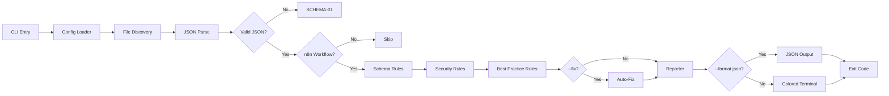

# n8n-lint

[](https://opensource.org/licenses/MIT)
[](https://nodejs.org/)
[]()

**Static analysis for n8n workflow JSON files.** Catch credential leaks, deprecated nodes, schema errors, and best-practice violations before they hit production. 16 rules, zero config required, CI-ready.

---

## Quick Start

```bash
npx github:lorenzespinosa/n8n-lint .
```

That's it. Scans all `.json` workflow files in the current directory and prints results.

## Installation

```bash
# Global
npm install -g github:lorenzespinosa/n8n-lint

# Project-local
npm install --save-dev github:lorenzespinosa/n8n-lint

# No install (npx)
npx github:lorenzespinosa/n8n-lint ./workflows/
```

## Usage

```bash
# Lint a single file
n8n-lint workflow.json

# Lint a directory (recursive)
n8n-lint ./workflows/

# Auto-fix safe issues (strip instanceId, set active:false)
n8n-lint --fix ./workflows/

# JSON output for CI/scripting
n8n-lint --format json ./workflows/

# Errors only (quiet mode)
n8n-lint --quiet ./workflows/

# Custom config
n8n-lint --config .n8nlintrc.json ./workflows/
```

### Sample Output

```
workflows/intake-form.json
  ✗ [SEC-01] Possible Bearer token detected: "Bearer sk-abc123..."
  ✗ [SEC-02] meta.instanceId found: "abc123" — strip before sharing
    Fix: Remove meta.instanceId from the workflow JSON
  ⚠ [BP-02] Node "My Function" uses deprecated "n8n-nodes-base.function" — use "n8n-nodes-base.code" instead
  ⚠ [BP-05] Node "API Call" is an HTTP Request without error handling

workflows/valid-workflow.json
  ✓

2 files checked · 2 errors · 2 warnings
```

## Rule Reference

| ID | Severity | Category | Description | Fixable |
|---|---|---|---|---|
| **SCHEMA-01** | error | Schema | Invalid JSON syntax | — |
| **SCHEMA-02** | error | Schema | Missing required top-level fields (`name`, `nodes`, `connections`, `active`) | — |
| **SCHEMA-03** | error | Schema | Missing required node fields (`id`, `name`, `type`, `typeVersion`, `position`) | — |
| **SCHEMA-04** | error | Schema | Connection references a non-existent node | — |
| **SEC-01** | error | Security | Hardcoded credentials, API keys, or tokens in node parameters | — |
| **SEC-02** | error | Security | `meta.instanceId` present — leaks server identity | ✅ `--fix` |
| **SEC-03** | warning | Security | Root-level `id` field — instance-specific, not portable | ✅ `--fix` |
| **SEC-04** | error | Security | URL contains auth tokens in query parameters | — |
| **SEC-05** | warning | Security | Credential names/IDs leak internal naming | — |
| **BP-01** | error | Best Practice | `active: true` — templates should be `false` | ✅ `--fix` |
| **BP-02** | warning | Best Practice | Deprecated `Function` node — use `Code` node | — |
| **BP-03** | warning | Best Practice | Orphaned node with no connections | — |
| **BP-04** | error | Best Practice | Duplicate node names in same workflow | — |
| **BP-05** | warning | Best Practice | HTTP Request without error handling (`continueOnFail` or error workflow) | — |
| **BP-06** | warning | Best Practice | Large workflow (>50 nodes) — decompose into sub-workflows | — |
| **BP-07** | warning | Best Practice | Potential infinite loop — cycle detected without IF/Switch termination | — |

## Configuration

Create `.n8nlintrc.json` in your project root:

```json
{
  "rules": {
    "SEC-03": "off",
    "SEC-05": "off",
    "BP-03": "warn",
    "BP-06": "error"
  }
}
```

Values: `"error"`, `"warn"` / `"warning"`, `"off"` / `false`

## Auto-Fix

`--fix` safely corrects these issues in-place:

| Issue | Fix Applied |
|-------|------------|
| `meta.instanceId` present | Removed |
| Root-level `id` present | Removed |
| `active: true` | Set to `false` |

Only non-destructive fixes are applied. Other rules require manual correction.

## CI Integration

### GitHub Actions

```yaml
name: Lint n8n Workflows

on: [push, pull_request]

jobs:
  n8n-lint:
    runs-on: ubuntu-latest
    steps:
      - uses: actions/checkout@v4
      - uses: actions/setup-node@v4
        with:
          node-version: 20
      - run: npx github:lorenzespinosa/n8n-lint ./workflows/
```

Exits with code `1` on errors — fails the CI job automatically.

### JSON Output for CI

```bash
n8n-lint --format json ./workflows/ > lint-results.json
```

Returns a JSON array of `{ file, issues: [{ ruleId, severity, message, node, fix }] }`.

## Exit Codes

| Code | Meaning |
|---|---|
| `0` | All files passed (warnings are non-blocking) |
| `1` | One or more errors found |
| `2` | Invalid arguments or no files found |

## Architecture



## Contributing

See [CONTRIBUTING.md](CONTRIBUTING.md) for how to add new rules, run tests, and submit PRs.

### Adding a New Rule

1. Create `src/rules/<category>/your-rule.js`
2. Export `{ id, severity, description, check(workflow) }`
3. `check()` returns `[{ message, node?, fix? }]`
4. Add to category's `index.js` export array
5. Create test fixtures in `test/fixtures/valid/` and `test/fixtures/invalid/`
6. Add test case in `test/rules/linter.test.js`

## Related Projects

- [n8n-error-handling-pattern](https://github.com/lorenzespinosa/n8n-error-handling-pattern) — Error handling templates this linter validates
- [n8n-legal-ops-templates](https://github.com/lorenzespinosa/n8n-legal-ops-templates) — Legal ops workflow templates
- [n8n-ai-agent-delegator](https://github.com/lorenzespinosa/n8n-ai-agent-delegator) — Multi-agent AI system templates

## License

[MIT](LICENSE) © 2025 Lorenz Espinosa

---

<!-- hire-cta -->
## 👋 Built by Lorenz Espinosa

I design and ship production automation for ops-heavy businesses — webhook-driven, AI-powered systems with validation, retries, and audit logging baked in. **50+ processes automated · $800K+ saved.**

**Want something like this built for your team?**

[](https://github.com/lorenzespinosa) &nbsp;[](mailto:renzespinosa13@gmail.com?subject=Automation%20project%20inquiry&body=Hi%20Lorenz%2C%0A%0AGoal%3A%0ASystems%2Ftools%20involved%3A%0ATimeline%3A%0A) &nbsp;[](https://www.linkedin.com/in/lorenz-leslie-espinosa/)
