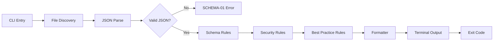

# n8n-lint

[](https://www.npmjs.com/package/n8n-lint)
[](https://github.com/example/n8n-lint/actions)
[](https://opensource.org/licenses/MIT)

**Static analysis for n8n workflow JSON files.** Catch credential leaks, deprecated nodes, schema errors, and best-practice violations before they hit production.

---

## Quick Start

```bash
npx n8n-lint .
```

That's it. Scans all `.json` workflow files in the current directory and prints results.

## Installation

```bash
# Global
npm install -g n8n-lint

# Project-local
npm install --save-dev n8n-lint
```

## Usage

```bash
# Lint a single file
n8n-lint workflow.json

# Lint a directory (recursive)
n8n-lint ./workflows/

# Lint multiple paths
n8n-lint workflow1.json ./more-workflows/

# Disable specific rules
n8n-lint --disable SEC-02,BP-01 .
```

### Sample Output

```
workflows/intake-form.json
  SEC-01  error    Possible credential leak: Bearer token found in node "HTTP Request"
  BP-02   warning  Deprecated node type "Function" in node "My Function" - use Code node instead

workflows/notify-slack.json
  BP-03   warning  Orphaned node "Debug Set" is not connected to any other node

  3 files checked | 1 error | 2 warnings
```

## Rule Reference

| ID | Severity | Description | Fixable |
|---|---|---|---|
| **SCHEMA-01** | error | Invalid JSON syntax | -- |
| **SCHEMA-02** | error | Missing required top-level fields (`name`, `nodes`, `connections`) | -- |
| **SCHEMA-03** | error | Missing required node fields (`id`, `name`, `type`, `position`, `parameters`) | -- |
| **SCHEMA-04** | error | Connection references a node that does not exist | -- |
| **SEC-01** | error | Hardcoded credentials or API keys detected in node parameters | -- |
| **SEC-02** | warning | `meta.instanceId` present - leaks server identity | auto |
| **SEC-03** | warning | Root-level `id` field present - leaks internal database ID | auto |
| **SEC-04** | warning | URL contains query-string tokens or API keys | -- |
| **SEC-05** | warning | Credential name references appear in exported JSON | -- |
| **BP-01** | warning | `active: true` should not be committed to version control | auto |
| **BP-02** | warning | Deprecated node type (Function, FunctionItem, Merge v1) | -- |
| **BP-03** | warning | Orphaned node not connected to any other node | -- |
| **BP-04** | warning | Duplicate node names within the same workflow | -- |

**Fixable** = `auto` means a future `--fix` flag will handle it automatically.

## Configuration

> Configuration file support (`.n8nlintrc.json`) is planned for v2.

Currently, rules can be disabled via the `--disable` CLI flag:

```bash
n8n-lint --disable SEC-02,SEC-03 ./workflows/
```

## CI Integration

### GitHub Actions

```yaml
name: Lint n8n Workflows

on: [push, pull_request]

jobs:
  n8n-lint:
    runs-on: ubuntu-latest
    steps:
      - uses: actions/checkout@v4
      - uses: actions/setup-node@v4
        with:
          node-version: 20
      - run: npx n8n-lint ./workflows/
```

The process exits with code `1` when errors are found, which fails the CI job automatically.

## Exit Codes

| Code | Meaning |
|---|---|
| `0` | All files passed (warnings are non-blocking) |
| `1` | One or more errors found |
| `2` | Invalid arguments or no files found |

## Architecture



## Contributing

See [CONTRIBUTING.md](CONTRIBUTING.md) for how to add new rules, run tests, and submit PRs.

## License

[MIT](LICENSE)
